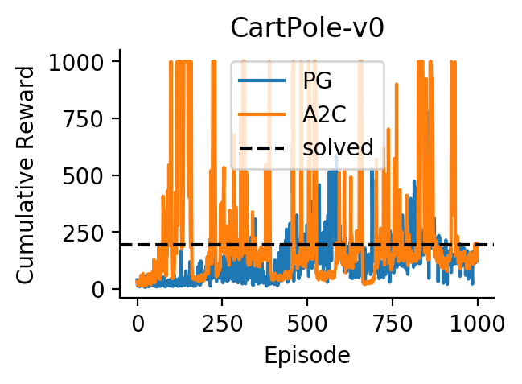

---
layout: post 
title: Actor-Critic - Using relative returns to properly scale policy gradients 
date: 2019-05-13
---  
[[Back Home]](/)  [[Back to Blog]](/blogs/post) 

# Markov Decision Process (MDP) 

An MDP and a policy together produce a sequence of trajectories $s_{0:\infty}, a_{0:\infty}$, and $r_{0:\infty}$ specified by:
* a transition kernel $p(s_{t+1} \| s_t, a_t)$, 
* a stationary policy $\pi(s_t \| a_t)$, 
* a reward function $r_t = R(s_t, a_t)$. 

Given a trace ($s_{0:n}$, $a_{0:n}$), the induced probability of the trace is:

$$p(s_{0:n}, a_{0:n}) = \prod_{t=0}^n p(s_t | s_{t-1}, a_{t-1}) \pi(a_t | s_t) $$

where we use convention $p(s_0 \| s_{-1}, a_{-1}) = p(s_0 \| \emptyset) = p(s_0)$. Note that the marginal state distribution $p(s)$ is fully specified by the policy $\pi$. Indeed, we first notice that $\pi$ induces a Markov chain from the MDP by:

$$p(s'|s) = \int p(s'|s,a) \pi(a|s) da.$$

The marginal state distribution $p(s)$ satisfies: 

$$p(s') = \int p(s'|s) p(s) ds.$$

Thus, the marginal state distribution is the stationary distribution of the induced Markov chain; hence is commonly denoted by $d^{\pi}(s)$. We exchangeably use $d^{\pi}(s)$ and $p(s)$ for the marginal state distribution. 

# Policy Gradient (PG) 
We parameterize the policy $\pi_{\theta}(a|s)$ by $\theta$, and directly learn this policy by maximizing the expected discounted rewards. For simplicity, we omit $\theta$ in $\pi_{\theta}$ in the following derivations. 

The expected discounted reward under policy $\pi$ is:

$$J(\theta) = \int d^{\pi}(s) V^{\pi}(s) ds = \mathbb{E} \left[ \sum_{t=0}^T \gamma^t r_t \right]$$ 

where the expectation is due to the stochasticity of trajectories and to the state marginal distribution. 

Since the expectation involves $\pi$ via $d^{\pi}(s)$, $\nabla_{\theta} J(\theta)$ involves taking the gradient of $d^{\pi}(s)$ wrt $\theta$ as well. Fortunately, the **policy gradient theorem** (read more in [2]) tells us that we can ignore the derivative of the state distribution $d^{\pi}(s)$:

$$\boxed{\nabla_{\theta} J(\theta) \propto \int d^{\pi}(s) \nabla_{\theta} V^{\pi}(s) ds }$$

Consequently, the gradient can be conveniently derived as:

$$\nabla_{\theta} J(\theta) = \nabla_{\theta} \int \left(\sum_{t=0}^T \gamma^t r_t \right) p(s_{0:T}, a_{0:T}) ds_{0:T} da_{0:T} $$

$$ \label{eq:grad_pg_core}
=\mathbb{E}_{p(s_{0:T}, a_{0:T})} \left[  \left( \sum_{t=0}^T \gamma^t r_t \right) \left( \nabla_{\theta} \sum_{t=0}^T \log \pi(a_t | s_t) \right)   \right]
$$

$$ \label{eq:grad_pg}
=  \sum_{t=0}^T \mathbb{E}\left[  \left( \sum_{t=0}^T \gamma^t r_t \right)  \nabla_{\theta}\log \pi(a_t | s_t)  \right].
$$

Thus, we can obtain an unbiased estimate $\left( \sum_{t=0}^T \gamma^t r_t \right) \left( \nabla_{\theta} \sum_{t=0}^T \log \pi(a_t | s_t) \right) $ 
of the gradient by sampling a trajectory $(s_0, a_0, ..., s_T, a_T) \sim p(s_{0:T}, a_{0:T})$. The intuition of PG is to play out a Monte Carlo trajectory $\tau = (s_0, a_0, r_0, ..., s_T, a_T, s_T)$ (eq. $\ref{eq:grad_pg_core}$) and move in the policy space in the direction that increases the trajectory likelihood scaled by the trajectory's return $\sum_{t=0}^T \gamma^t r_t$. 

Some insights about PG: 
* Useful for continuous action space: PG directly models the policy. Q-learning does not have this advantage as in Q-learning we need to take $arg\max_{a}Q(s,a)$. 

* Useful for stochastic policy.

* Might be sample inefficiency: PG plays out the whole episode to compute its return and adjust the policy weights by maximum likelihood principle. 

* Suffers high variance and low convergence rate: Why? Scaled the gradient of the log likelihood by the **absolute** scale, i.e., the total return $\sum_{t=0}^T \gamma^t r_t$ is naive for Monte Carlo and potentially problematic. First, we care more about the **relative** improvement of the return rather than the absolute value of the return when we adjust the policy weights. Second, two trajectories $\tau$ and $\tau'$ might have the same total returns $R := \sum_{t=0}^T \gamma^t r_t = R' := \sum_{t=0}^T \gamma^t r'_t$ (thus PG will adjust the policy by the same amount) but have very different behaviours, e.g., $\tau$ does indeed play out all average good actions at each time steps while $\tau'$ plays a very excellent action in the first time step but followed by all bad actions in the other steps (it is not hard to construct such a example). In that case, the preference for trajectory $\tau$ should not be the same for trajectory $\tau'$ as treated by PG. This is also a reason for why PG has low convergence rate. Solution? Yes, get back to what actually matters: scale the log likelihood gradient by the **relative** return instead of the **absolute** return. At this point, the idea becomes more clear: A natural approach to define a relative return of a trajectory is: 

$$
\texttt{relative_return} = \sum_{t=0}^T \gamma^t r_t - V(s_t)
$$

where $V(s_t)$ is the value-function estimate at state $s_t$. The idea of using relative return to scale the policy gradients is precisely the core idea of advantage actor critic presented in the following section. Of course, as always, we can use $n$-step TD (temporal difference) error to compute the relative return without the need of playing out the whole episode for update: 

$$
\texttt{relative_return} = r_t + \gamma V(s_{t+1}) - V(s_t) \\ 
= r_t + \gamma r_{t+1} + \gamma^2 V(s_{t+2}) - V(s_t) \\
= \sum_{i=0}^{n-1} \gamma^{i} r_{t+i} + \gamma^{n} V(s_{t+n}) - V(s_t)
$$

*Side note #1*: the relative return I use in this post can be more commonly referred to as Advantage function. 
# Advantage Actor Critic: 
We use the following identity to restructure Eq. $(\ref{eq:grad_pg})$ into a more beneficial form: 

$$\mathbb{E}_{\pi_{\theta}(a|s)} \left[ \nabla_{\theta} \log \pi_{\theta}(a|s) \right] = 0.$$

We have, 

$$ 
\nabla_{\theta} J(\theta) = \sum_{t=0}^T \mathbb{E}\left[  \left( \sum_{t=0}^{t-1} \gamma^t r_t \right)  \nabla_{\theta}\log \pi(a_t | s_t)  +\left( \sum_{t=t}^{T} \gamma^t r_t \right)  \nabla_{\theta}\log \pi(a_t | s_t) \right]
$$

$$
= \sum_{t=0}^T \mathbb{E}\left[  \left( \sum_{t=0}^{t-1} \gamma^t r_t \right)  \nabla_{\theta}\log \pi(a_t | s_t) \right]
$$

$$
= \sum_{t=0}^T \mathbb{E}\left[  \left( \sum_{\tau=t}^{T} \gamma^{\tau} r_{\tau} - b(s_t) \right)  \nabla_{\theta}\log \pi(a_t | s_t) \right]
$$

for any function $b(s_t)$. The function $b(s_t)$ is called baseline. Though adding a basline to policy gradient does not change the gradient formula, in practice when we perform stochastic gradient ascent, a baseline can help reduce the variance of the stocastic gradient estimate. The more $b(s_t)$ is correlated with $\sum_{\tau=t}^{T} \gamma^{\tau} r_{\tau}$, the lower the variance of the stochastic gradient estimate. In advantage actor critic, the state-value function is used as the baseline for variance reduction via advantage function (1-step TD): 

$$ \label{eq:advantage_func}
A(s_{t+i}, r_{t+i}, s_{t+i+1}) = r_{t+i} + \gamma V^{-}(s_{t+i+1}) - V(s_{t+i})
$$

where $0 \leq i \leq n-1$, the minus sign denotes detaching from the computation graph (i.e., keeping its weights fixed during sgd update), and $n$ is the period (in terms of number of steps) during which we would like to collect samples before updating the actor and critic. 

Hence, given a $n$-step trajectory $\tau_{n} := (s_t, a_t, r_t, ..., s_{t+n-1}, a_{t+n-1}, s_{t+n})$, the value and action losses are: 

$$
L_{V}(\tau_n) = \sum_{i=0}^{n-1} A(s_{t+i}, r_{t+i}, s_{t+i+1})^2 
$$

$$
L_{\pi}(\tau_n) = \sum_{i=0}^{n-1} A^{-}(s_{t+i}, r_{t+i}, s_{t+i+1}) \log \pi(a_{t+i} | s_{t+i})
$$

*Side note #2*: A trivial extension would be computing advantage function in eq. $(\ref{eq:advantage_func})$ using $k$-step TD error instead of $1$-step TD error where $1 \leq k \leq n-i$ (e.g., we can dynamically set $k = n-i$). 

*Side note #3*: We can create multiple copies of the agent with multiple copies of the environment and let's these agents playing in their own corresponding environments in parallel. Then these agents update a shared global agent. This will significantly increase exploration of A2C thus improve convergence rate. Depending on whether the update from the local agents to the shared global agent is sync or async, we have algorithm (parallel, syncronous version of) A2C or [A3C (Asyncronous A2C)](https://arxiv.org/abs/1602.01783), respectively. 

<!--  -->

<figure>
  
  <figcaption>Cummulative rewards of PG and A2C on CartPole-v0 (<a href="https://github.com/thanhnguyentang/pyrl/blob/master/algs/pytorch_pg_a2c.py">Code</a> to generate this figure).</figcaption>
</figure>

The A2C can reach the maximum reward very early while PG cannot reach the maximum reward. It takes more episodes for PG to reach the solved level (around at epoch $300$) while A2C already reaches the solved level at around $< 100$ episode. 

*Side note #3*: RL algorithms are sensitive to hyperparameter settings. Especially in this case, PG is more sensitive than A2C. 

# References: 
[1] http://www.tuananhle.co.uk/notes/dqn-pg-a2c.html  
[2] https://lilianweng.github.io/lil-log/2018/04/08/policy-gradient-algorithms.html#policy-gradient  
[3] https://medium.com/@jonathan_hui/rl-policy-gradients-explained-9b13b688b146  
[4] http://rail.eecs.berkeley.edu/deeprlcourse/static/slides/lec-5.pdf 

