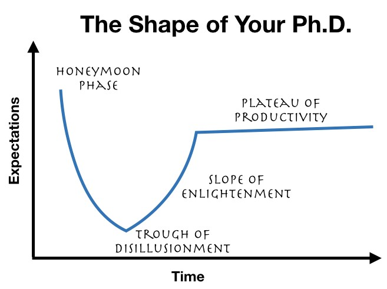

---
layout: post 
title: Garner Hype Circle of your Ph.D.   
date: 2019-07-22
---  
[[Back Home]](/)  [[Back to Blog]](/blogs/post) 

Disclaimer:  The idea in this post is NOT mine but rather from [1] which I summarize to remind me of developing strong will, grit and awareness of difficulties I might face in science (Yes, I am in the phase of trough of disillution where I can appreciate this advice but not able to produce such advice myself yet; but anyway it is extremly helpful to know this advice even in reality things might not strictly follow these 4 phases)

<figure>
  
  <figcaption>The shape of your Ph.D. (figure credit: [1])</figcaption>
</figure>

* **Phase 1 - Honeymoon** 
    * Grad students start out super excited about the field they are entering (e.g., this is especially true in MLAI where there are many unnecessary hypes. Even I finished my Master before entering my PhD, I still have this feeling and still feel that I need to learn a lot more and become more scientically mature)  
    * Usually in your first year 

* **Phase 2 - Trough of disillusion** 
    * The enthusiasm will be faded because science is hard 
    * You realize that many of your ideas are either (i) done already, or (ii) not really research (incremental), or (iii) impossible to do given the current state of knowledge, time and tools. 
    * You experience rejections (paper rejections, fellowship rejections) 
    * Even when you start producing publishable work, it takes longer than expected or it does look as good as you might have hoped 
    * This phase could happen in your first semester or even in your third year! 
    * Reason of this phase: **the gap between your taste and your skill**. Analogy: you can easily appreciate good music, but to produce such good music yourself, it needs more than just your music taste; it requires years of practice to reduce the gap between your taste and your skill. 
    * To feel this gap is painful and the pain is inevitable for those who do creative work like research. 
    * Many people quit at this phase 
    * To close this gap, you need to do a lot of work 

* **Phase 3 - Slope of enlightenment** 
    * But those who **embrace uncertainty** and have **strong will** will survive Phase 2 and arrive in this new phase. 
    * You work hard anyway and you will get better 
    * Alternatively, you can decide this is not for you and you can choose a different path (that's OK) 

* **Phase 4 - Plateau of productivity**  
    * Through grit and strong will, you will get to plateau of productivity  
    * People start noticing your work, who you are 

**Takeaway message**: 

* embrace uncertainty and strong will  
* grit > intelligence  

**Reference**: 

[1] https://medium.com/@scyrus89/the-shape-of-your-ph-d-426975399d88 

